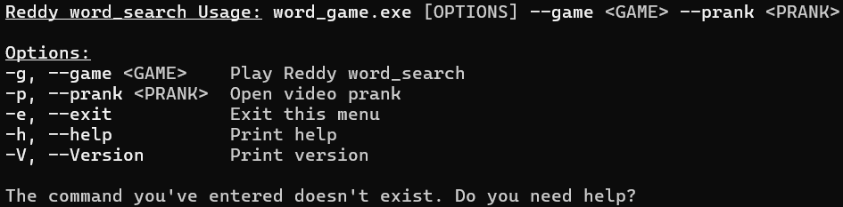
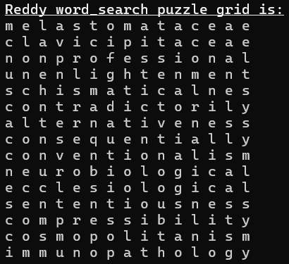

# word_search
Welcome! This project is an env argument based CLI for a word search puzzle game. The objective is to find all the words from the grid with the given size. Work In Progress. This project is Open Source, but not yet finished. Feel free to fork/clone this and send a pull request after it.

> You can reach out to me on Discord: [RedIsGaming](https://discordapp.com/users/724341024415285319)<br/>

## Intention
> [!TIP]<br/>
> The intention of this project was to use as less of AI tools as possible and with no autocompletion from Copilot. However, I did used Copilot for fixes, explainations and problem solving issues. Also I wanted to use as less (extern) crates as possible, because I want to know the underlying principles of Rust.

## Args example
Here is an example how the arg list looks like:



## Puzzle grid
Here is how random selected words in a puzzle grid may look, depending on the size choosen, WIP (Work In Progress):



## Author
[RedIsGaming](https://github.com/RedIsGaming/)

## Language(s) and tools
- [Rust](https://www.rust-lang.org/tools/install)
- [VSCode](https://code.visualstudio.com/download)
    - rust-analyzer (extension)
    - Even Better TOML (extension)
- [Cargo](https://doc.rust-lang.org/cargo/getting-started/installation.html)
    - clippy (feature/crate)
    - fmt (feature)

## License
[MIT license](LICENSE)

## Status
> <br/>
> <span style="color: #0F9;">word_search last updated on 6-6-2024.</span><br/>
> <ins style="font-size: 0px;">.</ins>

## Contact
[Discord](https://discordapp.com/users/724341024415285319)

## How to use this project?
### Side note
> [!NOTE]<br/>
> I expect that you already have some programming knowledge (in Rust) and know how to run binaries with Cargo. If you don't have all necassery tools, I recommend installing them. Git is needed to clone the project, so if you don't have it, you know what to do. I won't explain everything in detail. You can search the rest up on the internet or ask me in Discord.

### How to run?
First clone the word_search project to any location you desire.
```shell
git clone https://github.com/RedIsGaming/word_search.git
```

Then switch to that directory.
```shell
cd word_search
```

Then to word_game. (This step is optional now since there are workspaces available)
```shell
cd word_game
```

Now you can use Cargo and run the following command.
```rs
cargo run                  //<Error>
cargo run --               //<Error>
cargo run -- <Arg1> <Arg2> //<Error>
cargo run -- <Arg1>        //<Ok>
```

> [!IMPORTANT]<br/>
> The program expects 1 and only a maximum of 1 argument. All other attempts will fail. The following argument will help you explore the word_search menu with a set of options.
```rs
cargo run -- -h
```

## todo!()
- [x] Setting up main project
- [x] Creating env args list
- [x] Functions written for args
- [x] Puzzle grid settable size
- [x] Random words set for grid
- [ ] Truely getting random sorted bytes
- [ ] Fully playable word search game
- [x] Replace empty bytes with letters
- [ ] Running tests with functions
- [x] Documentation written and checked
- [x] Check full code with formatting
- [ ] Check full code syntax
